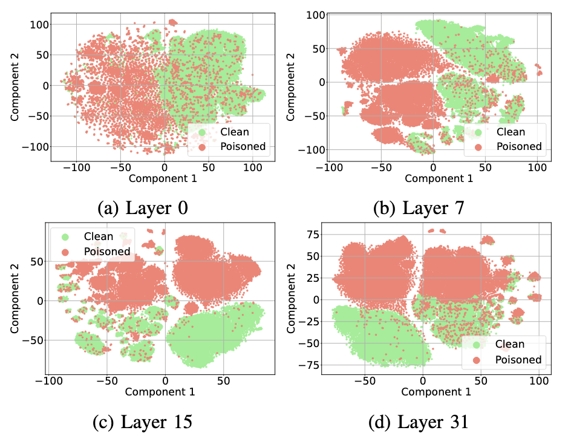

Hi there! I'm a Senior AI Security Researcher at Microsoft as well as a part-time student in the Department of Mathematics at Imperial College London. I'm passionate about AI safety, learning algorithms and the fundamental mathematics beyond machine learning and its interpretation. Please contact me if you see a collaboration opportunity! 

  

    
    
    
    
    
  

## News and Upcoming 

2024

- November: I'm attending the [London-Oxford Topological Data Analysis Seminar](https://sites.google.com/view/londoxtda/home) organized by my Dr.Anthea Monod.
- November: I joined the [GirlsWhoML](https://girlswhoml.com/) initiative to help create course content and teach for the AI security workshop to UK undergraduate students.
- October: I served as a Program Committee Member for [Safe Generative AI workshop @ NeurIPs 2024](https://safegenaiworkshop.github.io/).
- September: My team at MSRC are launching the [Adaptive Prompt Injection Challenge](https://microsoft.github.io/llmail-inject/) as part of SaTML 2025.
- July: I served as a Program Committee Member for [18th ACM Workshop on Artificial Intelligence and Security (AISec 2024)](https://aisec.cc/#committee) where I was also voted Top Reviewer!
- June: We released the [TaskTracker](https://github.com/microsoft/TaskTracker) dataset and codebase for behavioral drift detection.
- June: We published our new research [paper](https://arxiv.org/abs/2406.00799) "Are You Still On Track? Decting LLM Task Drift with LLM activations".
- February: I joined the Microsoft Security Response Centre at Microsoft Research Cambridge as a Senior AI Security Researcher.

2023

- October: I presented at the United Nations Internet Governance Forum in Kyoto, Japan on "Co-operative AI: Multi-Agent AI Safety and International Co-Operation".
- October: I presented at Microsoft BlueHat in Redmond, Washington - [Breach Path Busters: Using graphs and AI to decode cyber threats](https://www.youtube.com/watch?v=J621cAsKzZk).
- October: I started my part-time MSc in the Department of Mathematics at Imperial College London.
- February: I was promoted to Senior Security Researcher on the Microsoft Threat Hunting team.
- February: I joined the European Cyber Conflict Research Initiative as Cybersecurity Fellow.

## Publications

<table border="0">
<tr>
   <td width="25%">
       
   </td>
   <td width="75%" valign="top">
       <strong>Are you still on track!? Catching LLM Task Drift with Activations</strong> 
       <em>Sahar Abdelnabi, Aideen Fay, Giovanni Cherubin, Ahmed Salem, Mario Fritz, Andrew Paverd</em> 
       Submitted to SaTML 2025 
       <a href="https://arxiv.org/abs/2406.00799">Paper</a> / 
       <a href="https://x.com/AideenFay/status/1801690383694372996">Twitter</a>
   </td>
</tr>
</table>
